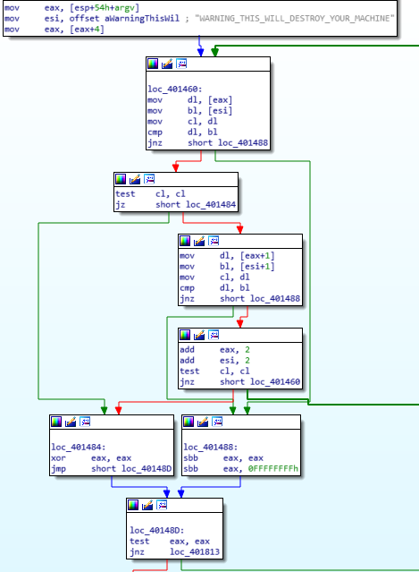
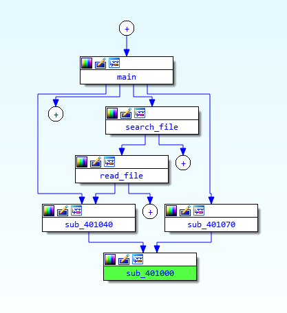

# Dear Diary,

## My security oriented Diary

- i found a bug in sudo while studying CVE-2021-3156. accepted and patched. https://github.com/sudo-project/sudo/issues/95
- i'm studying/explaining Malware from PMA Labs using IDA and Hopper

### 2021/03/30

- Dear Diary, today i'm starting a diary
- Dear Diary, i started you.
- I'm watching youtube video about Fuzzing & Buffer Overflow : https://www.youtube.com/watch?v=FCIfWTAtPr0
  - the video is too beginner oriented, i'll give a try to part 4 (finding the offset) anyway.
      Part 5 is about EIP. 
  - Not really useful to me (a priori), but the videos are very short so it's cool.
- I'm planning to give a try to sstic challenge 2021, it start this weekend : https://www.sstic.org/2021/news/
- i did some ARM64 disassembly stuff this morning while drinking my first coffee of the day, using hopper disasm. 
Turn out it's much easier when the source code isn't written in swift(c)(r)(tm)
  
- CVE-2021-3156 is scary. Congratz Qualys for finding it.
  - https://www.kb.cert.org/vuls/id/794544
  - Apple’s Big Sur is also vulnerable, as well as cisco, netapp, juniper, ...
  - Also, https://www.youtube.com/watch?v=2_ZaNBl6qNo
    - i like this channel, i subbed some times ago, and the discord dudes are cools too
- mysql suck :[
  - why is it so bad ?
- should i buy Hopper disasm ?
- i want to go home. i'm going home.
- i'm home
  
#### Exploring CVE-2021-3156 @ home

This is what i understood : 
- You can use multiple line in argument by escaping with \
- Sudo ignore the character following \
- what if \ is the last character ? it ignores \0 (NULL) and read stuff it shouldn't read because the null terminator is ignored.

```
Sudo before 1.9.5p2 contains an off-by-one error that can result in a heap-based buffer overflow, 
which allows privilege escalation to root via "sudoedit -s" 
and a command-line argument that ends with a single backslash character.
```

Let's find out.

- The commit fixing the bug is here https://github.com/sudo-project/sudo/commit/1f8638577d0c80a4ff864a2aad80a0d95488e9a8
- and here https://github.com/sudo-project/sudo/commit/b301b46b79c6e2a76d530fa36d05992e74952ee8
- and ... here ? https://github.com/sudo-project/sudo/commit/c4d384082fdbc8406cf19e08d05db4cded920a55
- This was also submitted by Qualys the same day, let's assume it's part of it https://github.com/sudo-project/sudo/commit/c0eecf85c8b0920a9398920d5f5dae0ee2804b46

Well... it's not as simple as "_we forgot that having a backlash as last character could happens_". No no no.
It's an error with flags and stuff, because sudo DO check for this. (i'll have to check for sure but i assume it does)

Also, sudo and sudoedit are the same binary. sudoedit is just a symlink to sudo, 
and sudo is checking its own name to set some flags here and there in order to behave as "sudo" or as "sudoedit".
Well, that's what i understood anyway. i'll check, of course.

My immediate thought was : what if it's called neither "sudo" nor "sudoedit" ? huh ? huh ? _aren't i smart_ ?
Well... i'm not the smartest one. 

This is the patch published 3 days after the CVE fix : https://github.com/sudo-project/sudo/commit/19d5845f8b6ae429a597d53c7f8201514537b590
```The program name may now only be "sudo" or "sudoedit".```

Anyway... code stuff !

The old code :
```c
    /* Pass progname to plugin so it can call initprogname() */
    progname = getprogname();
    sudo_settings[ARG_PROGNAME].value = progname;

    /* First, check to see if we were invoked as "sudoedit". */
    proglen = strlen(progname);
    if (proglen > 4 && strcmp(progname + proglen - 4, "edit") == 0) {
	progname = "sudoedit";
	mode = MODE_EDIT;
	sudo_settings[ARG_SUDOEDIT].value = "true";
    }
```

This is honestly a weird way to check if it's invoked as "sudoedit". It could technically be "anythinglongerthan4edit".
Why ? dunno ! Probably very _legacy_.

The new check is as easy as :
```c
    /* The plugin API includes the program name (either sudo or sudoedit). */
    progname = getprogname();
    sudo_settings[ARG_PROGNAME].value = progname;

    /* First, check to see if we were invoked as "sudoedit". */
    if (strcmp(progname, "sudoedit") == 0) {
	mode = MODE_EDIT;
	sudo_settings[ARG_SUDOEDIT].value = "true";
	valid_flags = EDIT_VALID_FLAGS;
    }
```

While we're here we can clearly see one bigass fix : 
```valid_flags = EDIT_VALID_FLAGS;```

Well... i know it is because youtube told me it was about flags. :]

The new code is still weird, imho.
It says : _The plugin API includes the program name (either sudo or sudoedit)._
But this is not what the code is doing. it checks if it's "_sudoedit_" or "_anything else_". 

Anyway... i'm on my windows, i have WSL and ubuntu installed.

```bash
sudoedit --version
sudoedit: Only one of the -e, -h, -i, -K, -l, -s, -v or -V options may be specified
usage: sudoedit [-AknS] [-r role] [-t type] [-C num] [-g group] [-h host] [-p prompt] [-T timeout] [-u user] file ...
```

huh ? okay then ...

```bash
sudoedit -V
sudoedit: Only one of the -e, -h, -i, -K, -l, -s, -v or -V options may be specified
usage: sudoedit [-AknS] [-r role] [-t type] [-C num] [-g group] [-h host] [-p prompt] [-T timeout] [-u user] file ...
```

C'mooon... really ?

how about this ?
```bash
sudo -V
Sudo version 1.8.31
Sudoers policy plugin version 1.8.31
Sudoers file grammar version 46
Sudoers I/O plugin version 1.8.31
```

I tried on my mac M1. "_sudo -V_" works. and _sudoedit_ is "_command not found_".

I'm starting up a linux cloud instance.

```bash
sudo -V
Sudo version 1.8.21p2
+ a hundred lines of stuff
```

```bash
sudoedit -V
sudoedit: Only one of the -e, -h, -i, -K, -l, -s, -v or -V options may be specified
usage: sudoedit [-AknS] [-r role] [-t type] [-C num] [-g group] [-h host] [-p prompt] [-T timeout] [-u user] file ...
```

nice ! i found a boring bug ! :o)

- it should not happen. the usage() clearly say that -v and -V are valid. 
- There are some other potential issues still happening with sudoedit. could it lead to a security issue ? dunno.

So let's check parse_args.c, again.

```c
    /* Is someone trying something funny? */
    if (argc <= 0)
	usage();
```

No, i'm not. I'm checking all calls to usage() from parse_args.

```
		case 'V':
		    if (mode && mode != MODE_VERSION)
			usage_excl();
		    mode = MODE_VERSION;
		    valid_flags = 0;
		    break;
		default:
		    usage();
```

mmm ?
Let's try something.

```
# sudo -z
sudo: invalid option -- 'z'
usage: sudo -h | -K | -k | -V
usage: sudo -v [-AknS] [-g group] [-h host] [-p prompt] [-u user]
usage: sudo -l [-AknS] [-g group] [-h host] [-p prompt] [-U user] [-u user] [command]
usage: sudo [-AbEHknPS] [-r role] [-t type] [-C num] [-g group] [-h host] [-p prompt] [-T timeout] [-u user] [VAR=value] [-i|-s] [<command>]
usage: sudo -e [-AknS] [-r role] [-t type] [-C num] [-g group] [-h host] [-p prompt] [-T timeout] [-u user] file ...

sudoedit -z
sudoedit: invalid option -- 'z'
usage: sudoedit [-AknS] [-r role] [-t type] [-C num] [-g group] [-h host] [-p prompt] [-T timeout] [-u user] file ...
```

ho so there are two different usage() for sudo and sudoedit.

```
/*
 * Tell which options are mutually exclusive and exit.
 */
static void
usage_excl(void)
{
    debug_decl(usage_excl, SUDO_DEBUG_ARGS);

    sudo_warnx("%s",
	U_("Only one of the -e, -h, -i, -K, -l, -s, -v or -V options may be specified"));
    usage();
}
```

Okay ... actually so the warning i get isn't from usage() but from usage_excl()

Let's check the 1.8.21p2 source code just in case

The source i got from apt source shows : 
```
case 'V':
    if (mode && mode != MODE_VERSION)
        usage_excl(1);
    mode = MODE_VERSION;
    valid_flags = 0;
    break;
default:
    usage(1);
```

```
/*
 * Tell which options are mutually exclusive and exit.
 */
static void
usage_excl(int fatal)
{
    debug_decl(usage_excl, SUDO_DEBUG_ARGS)

    sudo_warnx(U_("Only one of the -e, -h, -i, -K, -l, -s, -v or -V options may be specified"));
    usage(fatal);
}
```

It's pretty much the same i guess ?

The source also show that the main bug that issued the CVE is fixed :
```
    /* First, check to see if we were invoked as "sudoedit". */
    proglen = strlen(progname);
    if (proglen > 4 && strcmp(progname + proglen - 4, "edit") == 0) {
        progname = "sudoedit";
        mode = MODE_EDIT;
        sudo_settings[ARG_SUDOEDIT].value = "true";
        valid_flags = EDIT_VALID_FLAGS;
    }
```

The flag is here. mode is set and different than MODE_VERSION so it indeed show usage_excl().
But why ?

After some time thinking about it, it's obvious :

```
		case 'V':
		    if (mode && mode != MODE_VERSION)
			usage_excl();
		    mode = MODE_VERSION;
		    valid_flags = 0;
		    break;
```

But why does it call usage_excl() here ?

why is mode set but it's clearly not MODE_VERSION ?

Because sudoedit set ```mode = MODE_EDIT;```

I'll submit a bug report and see how it goes.

First day, first bug. yay \o/

Bug report : https://github.com/sudo-project/sudo/issues/95

---

- That was one big messy daily report. I wanted to explore a CVE and found a (minor) but instead.
- That's even better, isn't it ?
- Zzzz
- Or not, my bug was (partially :( )) fixed and closed already.
- and i found another problem (pretty much the same bug actually) when calling sudoedit -h
- I think i understand why there is no sudoedit on mac. it shouldn't exist in the first place, imho.
- When you read this diary you cleary see that i wrote stuff that were clearly incorrect. i'm not removing it. 
  it accurately describe my thought process and i'm not always right on first try.
- Zzz ?

---

### 2021/03/31

- Dear diary, it's morning already. I'm not working today. More CVE ?
- It turn out that Macos also have (had) the sudoedit problem. 
  - sudoedit does not exist by default on mac but the code is still here anyway
  - just create a sudoedit symlink ```ln -s /usr/bin/sudo sudoedit```
  - it does not require any privilege to be created
  - the sudoedit code is still in the sudo binary
  
```bash
% ln -s /usr/bin/sudo sudoedit                   
% ./sudoedit -V
sudoedit: Only one of the -e, -h, -i, -K, -l, -s, -v or -V options may be specified
usage: sudoedit [-AknS] [-C num] [-D directory] [-g group] [-h host] [-p prompt] [-R directory] [-T timeout] [-u user] file ...
% rm sudoedit
```

<!-- img src="./img/cyberexperience.jpg" alt="drawing" width="200"/ -->

- My bugreport has been closed with a patch that check if progname is "sudoedit"
- They also added a seperate getopt config for sudoedit

```
case 'V':
    if (mode && mode != MODE_VERSION) {
    if (strcmp(progname, "sudoedit") != 0)
        usage_excl();
    }
```

```
static const char sudo_short_opts[] = "+Aa:BbC:c:D:Eeg:Hh::iKklnPp:R:r:SsT:t:U:u:Vv";
static const char edit_short_opts[] = "+Aa:BC:c:D:g:h::knp:R:r:ST:t:u:V";
+ more stuff to handle the new getopt config
```

- It's not my code, so i can't say that my code has been added to billions of devices.
But it's because of my report, and this Diary, that the code has been patched.
it still feels good :]

- Perhaps i should take it easy since i want to do a difficult challenge starting in a few days.
Non non Biyori, then some simple asm later.
- I'm going to play with "Practical Malware Analysis" binaries. 
  It's easy stuff but it's exactly what i want for today. 
  I'm going back to work tomorrow and it will be a PITA day.

---

#### Playing with PMA Labs

- Let's start with Lab01-01.exe. 
- i'm even using _IDE Free 70_ instead of my licensed version.
- According to "_detect it easy_" it's a 32bits PE executable, unpacked, compiled with MSVC 6.0
- Opening it in IDA with default option
- Only the EntryPoint is exported, it import kernel32 and msvcrt
- Some usefull strings

```
WARNING_THIS_WILL_DESTROY_YOUR_MACHINE
C:\Windows\System32\Kernel32.dll
Lab01-01.dll
Kernel32.
C:\windows\system32\kerne132.dll <- it's one three two, not L 3 2
kernel32.dll
kerne132.dll <- it's one three two, not L 3 2
```

- it's easy to guess what's going to happens if you execute it. it will destroy/replace your kernel32.dll
- Opening the Entry Point in IDA. Nothing unusual, it appears to be some standard init.
- Before exiting, it call a sub, which should be our WinMain and the var pushed before the call should be our usual args.

```
...
.text:004018EA                 call    ds:__p___initenv
.text:004018F0                 mov     ecx, [ebp+var_20]
.text:004018F3                 mov     [eax], ecx
.text:004018F5                 push    [ebp+var_20]
.text:004018F8                 push    [ebp+var_2C]
.text:004018FB                 push    [ebp+var_1C]
.text:004018FE                 call    sub_401440   ;<- this should be our WinMain
.text:00401903                 add     esp, 30h
.text:00401906                 mov     [ebp+var_24], eax
.text:00401909                 push    eax             ; Code
.text:0040190A                 call    ds:exit
```

Let's rename it to WinMain and let IDA do its magic (the stuff we're willing to pay for)

```
...
.text:004018EA                 call    ds:__p___initenv
.text:004018F0                 mov     ecx, [ebp+lpCmdLine]
.text:004018F3                 mov     [eax], ecx
.text:004018F5                 push    [ebp+lpCmdLine] ; lpCmdLine
.text:004018F8                 push    [ebp+hPrevInstance] ; hPrevInstance
.text:004018FB                 push    [ebp+hInstance] ; hInstance
.text:004018FE                 call    WinMain
.text:00401903                 add     esp, 30h
.text:00401906                 mov     [ebp+var_24], eax
.text:00401909                 push    eax             ; Code
.text:0040190A                 call    ds:exit
```

Jumping into WinMain, it feels wrong. Let's call it main instead.

```
...
call    _initterm
call    ds:__p___initenv
mov     ecx, [ebp+envp]
mov     [eax], ecx
push    [ebp+envp]      ; envp
push    [ebp+argv]      ; argv
push    [ebp+argc]      ; argc
call    main
add     esp, 30h
mov     [ebp+var_24], eax
push    eax             ; Code
call    ds:exit
```

Isn't it much better ? _initenv_ (whatever that is) create _envp_. now it feels right.

The first few lines of our main(int argc, const char **argv, const char **envp), commented

```
mov     eax, [esp+argc]
sub     esp, 44h        ; reserve space on stack for local var
cmp     eax, 2          ; argc == 2 ?
push    ebx             ; save our usual stuff
push    ebp
push    esi
push    edi
jnz     loc_401813      ; jump according to the result of cmp
```

Let's explain, because i have time. remove the book-keeping stuff and focus on the user code.
```
mov     eax, [esp+argc]
cmp     eax, 2          ; argc == 2 ?
jnz     loc_401813      ; jump according to the result of cmp
```

- eax = argc. nothing to see here. argc is the number of argument. 1 mean "no argument" (the 1st arg is the program name), 2 mean, of course, 1 argument
- compare eax with 2. So we can guess it's expecting to be called with an argument in command line.
- cmp set the ZF and CF flag according to the result of the comparison.

| cmp dst, src | ZF | CF |
|--------------|----|----|
| dst = src    | 1  |  0 |
| dst < src	   | 0  | 1  |
| dst > src	   | 0  | 0  | 

So if _argc == 2_ then ZF should be 1

Next is JNZ (Jump Non Zero), also known as JNE (Jump Not Equal)
```
jnz : jumps to the specified location if the Zero Flag (ZF) is cleared (0).
jnz is commonly used to explicitly test for something not being equal to zero whereas jne is commonly found after a cmp instruction.
```

I'll be honest here. i always get confused by JNZ. it jump if ZF = 0. But if you think of it as being "JNE" it's much easier.

Anyway : ```if(argc != 2) { goto loc_401813; }```

```loc_401813:
pop     edi
pop     esi
pop     ebp
xor     eax, eax    ; eax = 0
pop     ebx
add     esp, 44h
retn
```

- it jump directy to the end of our main. 
  Therefore, because eax = 0, we get something like : ```if(argc != 2) { return 0; }```
- our "malware" wont work without argument. It's probably a security measure because this is a fake malware for educational purpose.

What's happening if argc = 2 ?
```
mov     eax, [esp+54h+argv]
mov     esi, offset aWarningThisWil ; "WARNING_THIS_WILL_DESTROY_YOUR_MACHINE"
mov     eax, [eax+4]
```

- First, it get a pointer to argv (which contain our arguments from command line)
- next, esi will point to a string, esi is often used for loop
- finally, eax = eax+4. we're in 32bit, a pointer is 4 byte long. 
  Basically, eax will now point to argv[1] instead of argv[0]
- we have a string, a loop and argv[1]. easy guess : it will check if the exe will be called like this :
  
```
lab01.exe WARNING_THIS_WILL_DESTROY_YOUR_MACHINE
```

I'm skipping a bunch of mov, cmp, test, loop, with a final jnz going straight to exit if the comparaison fail.

For the curious : 



Next, all the following jnz goes to _exit_ so i'll skip it :

```
mov     edi, ds:CreateFileA
push    eax             ; hTemplateFile
push    eax             ; dwFlagsAndAttributes
push    3               ; dwCreationDisposition
push    eax             ; lpSecurityAttributes
push    1               ; dwShareMode
push    80000000h       ; dwDesiredAccess
push    offset FileName ; "C:\\Windows\\System32\\Kernel32.dll"
call    edi ; CreateFileA
mov     ebx, ds:CreateFileMappingA
push    0               ; lpName
push    0               ; dwMaximumSizeLow
push    0               ; dwMaximumSizeHigh
push    2               ; flProtect
push    0               ; lpFileMappingAttributes
push    eax             ; hFile
mov     [esp+6Ch+hObject], eax
call    ebx ; CreateFileMappingA
mov     ebp, ds:MapViewOfFile
push    0               ; dwNumberOfBytesToMap
push    0               ; dwFileOffsetLow
push    0               ; dwFileOffsetHigh
push    4               ; dwDesiredAccess
push    eax             ; hFileMappingObject
call    ebp ; MapViewOfFile
push    0               ; hTemplateFile
push    0               ; dwFlagsAndAttributes
push    3               ; dwCreationDisposition
push    0               ; lpSecurityAttributes
push    1               ; dwShareMode
mov     esi, eax
push    10000000h       ; dwDesiredAccess
push    offset ExistingFileName ; "Lab01-01.dll"
mov     [esp+70h+argc], esi
call    edi ; CreateFileA
cmp     eax, 0FFFFFFFFh
mov     [esp+54h+var_4], eax
push    0               ; lpName
jnz     short loc_401503

loc_401503:             ; dwMaximumSizeLow
push    0
push    0               ; dwMaximumSizeHigh
push    4               ; flProtect
push    0               ; lpFileMappingAttributes
push    eax             ; hFile
call    ebx ; CreateFileMappingA
cmp     eax, 0FFFFFFFFh
push    0               ; dwNumberOfBytesToMap
jnz     short loc_40151B

loc_40151B:             ; dwFileOffsetLow
push    0
push    0               ; dwFileOffsetHigh
push    0F001Fh         ; dwDesiredAccess
push    eax             ; hFileMappingObject
call    ebp ; MapViewOfFile
mov     ebp, eax
test    ebp, ebp
mov     [esp+54h+argv], ebp
jnz     short loc_401538
```


Thank you IDA for knowing the win32 api <3

- Hey... did you know that writing this take forever ?
- i'm supposed to be on a break.
- Enough for now. All the calls above speak for themselves. go read MSDN to know more :)


---

### 2021/03/32

- Dear diary, this day doesn't exist (citation needed)

---

### 2021/04/01

- Dear Diary, new COVID lockdown, again ... meh... :[
- Anyway, back to the previous exercise.

- _MapViewOfFile_ : https://docs.microsoft.com/en-us/windows/win32/api/memoryapi/nf-memoryapi-mapviewoffile
- _CreateFileMappingA_ : https://docs.microsoft.com/en-us/windows/win32/api/winbase/nf-winbase-createfilemappinga
- _CreateFileA_ : https://docs.microsoft.com/en-us/windows/win32/api/fileapi/nf-fileapi-createfilea

About CreateFileA dwDesiredAccess :

|  dwDesiredAccess  |   Mask     |
|-------------------|------------|
|  GENERIC_READ     | 0x80000000 |
|  GENERIC_WRITE    | 0x40000000 |
|  GENERIC_EXECUTE  | 0x20000000 |
|  GENERIC_ALL      | 0x10000000 |

- _CreateFileA_ return a file handle (in eax, return value are always in eax),
- then _CreateFileMappingA_ is passing this eax as _hFile_ argument and return a file handle (HANDLE) in eax
- which is used as the _hFileMappingObject_ argument.
- finally, _CreateFileMappingA_ return a LPVOID
  - If the function succeeds, the return value is the starting address of the mapped view.
  - If the function fails, the return value is NULL. To get extended error information, call GetLastError.
- TL;DR : _"C:\\Windows\\System32\\Kernel32.dll"_ is mapped in memory

- _Lab01-01.dll_ is created with CreateFileA, follow by CreateFileMappingA & MapViewOfFile. same as above.

I'm not at home with my IDA, VM, Windows, etc... so that's it for now. i'll have to go home to read the rest of the code.

---

Dear Diary, i'm home again. 

I'm reading the next piece of code and it's going to get a little bit messy.
The reason is that it call a bunch of sub_xxxxxx and i'll also need to rename some local var.
It's not difficult to guess what's going to happens, but since i'm writing this diary i'll push myself to reverse every part of it.

The list of local vars : 
```
var_44= dword ptr -44h
var_40= dword ptr -40h
var_3C= dword ptr -3Ch
var_38= dword ptr -38h
var_34= dword ptr -34h
var_30= dword ptr -30h
var_2C= dword ptr -2Ch
var_28= dword ptr -28h
var_24= dword ptr -24h
var_20= dword ptr -20h
var_1C= dword ptr -1Ch
var_18= dword ptr -18h
var_14= dword ptr -14h
var_10= dword ptr -10h
var_C= dword ptr -0Ch
hObject= dword ptr -8
var_4= dword ptr -4
argc= dword ptr  4
argv= dword ptr  8
envp= dword ptr  0Ch
```

With a quick look at the code, i have no way to really what the vars means so i'll have to reverse every sub one by one first.
Luckily, we have only 7 sub_, which is very very low.

After some browsing each of them, this is a small one. i already renamed it : 

```
call_controlfp proc near
push    30000h          ; Mask
push    10000h          ; NewValue
call    _controlfp
pop     ecx
pop     ecx
retn
call_controlfp endp
```

But it's only called by the entry point, which isn't user code so we can safely ignore it. 
```_controlfp : Gets and sets the floating-point control word.```

Another one, renamed it, also called by the entry point :

```
return_zero proc near
xor     eax, eax
retn
return_zero endp
```
We're down to 5 sub. 
3 of them do not do any external call to dll's function. 
2 of them call kernel32.dll (& msvcrt ?).

- sub_4010A0 (renamed to : read_file)
  - called by : sub_4011E0 (which i renamed to search_file)
  - system calls : CreateFileA, CreateFileMappingA, MapViewOfFile, IsBadReadPtr, UnmapViewOfFile, CloseHandle, _stricmp

- sub_4011E0 (renamed to : search_file)
  - called by : main, sub_4011E0 (yes, it's calling itself)
  - system calls : FindFirstFileA, malloc, _stricmp, FindClose, FindNextFileA, 

- For now i'll just rename "sub_4011E0" to "search_file" and "sub_4010A0" to "read_file".
Considering how it also call "Create_File" it's probably not just "reading" files, but for now i'll keep it as is.
It's just a random guess according to the calls it's doing.
- So, "main" call "search file" which is calling "read_file". I wish i could do graphs, but github doesn't support it.
- "read_file" also call "sub_401040"
- "sub_401040" only call "401000"

I guess it's time for a graph, i'll use the IDA's proximity browser.



Not bad, huh ? So, what is sub_401000 ? there is a loop in it, but here is the first part before the loop.

```
mov     edx, [esp+arg_4] ; what is arg_4 ?
xor     eax, eax        ; eax = 0
xor     ecx, ecx        ; ecx = 0
push    ebx
mov     ax, [edx+14h]
mov     cx, [edx+6]
push    esi
xor     esi, esi        ; esi = 0
test    ecx, ecx
push    edi
lea     eax, [eax+edx+18h]
jle     short loc_401039
```

Let's remove some stuff for now : 

```
mov     edx, [esp+arg_4] ; what is arg_4 ?
xor     ecx, ecx         ; ecx = 0
mov     cx, [edx+6]      ; <- what's at edx+6 ?
test    ecx, ecx         ; if (ecx == 0)
jle     short loc_401039 ; then jump to loc_401039
```

- Haaa what a pain ! "cx" is the the lower 16bit of the 32bit ecx register.
- Basically it seems to test if whatever is at edx+6 == 0
- "whatever is at edx+6" is defined by esp+arg_4.
- So, again, what is arg_4 ?

Dear Diary, i'm going to eat before i forget to, and read some manga. (Beware of the villainess)

See you tomorrow. i'm forcing myself to take a break.

---

### 2021/04/02

- Dear Diary, i just tested IDA Free 70 on my mac M1 : it works.
- The part of the code where i stopped yesterday still upset me.
- why +6 ? why 16 bits ? it's important to give up and keep going, perhaps i'll know why later. 
Perhaps it does not matter and it's just the compiler doing compiler stuff.
  But the purpose of the Diary is to go in depth. Or not... it's just my notepad, i do wtf i want to.
- For some reason i can't extract the PMA Labs on my M1, it says the password is incorrect.
- it seems to be a known problem. i installed "keka" and the extraction works.
- TL;DR : i can keep on reversing this exe on my mac now
- To be honnest, this is the kind of code where a decompiler would be helpful.
- And i have one, hopper disassembler. does it help ?

```
int sub_401000(int arg0, int arg1) {
    var_4 = arg0;
    stack[-4] = ebx;
    eax = *(int16_t *)(arg1 + 0x14);
    ecx = *(int16_t *)(arg1 + 0x6);
    stack[-8] = esi;
    esp = esp - 0xc;
    stack[-12] = edi;
    eax = eax + arg1 + 0x18;
    if (ecx <= 0x0) goto loc_401039;

loc_40101d:
    esi = 0x0;
    edi = var_4;
    goto loc_401021;

loc_401021:
    edx = *(eax + 0xc);
    if ((edi < edx) || (edi >= *(eax + 0x8) + edx)) goto loc_401031;

.l1:
    return eax;

loc_401031:
    esi = esi + 0x1;
    eax = eax + 0x28;
    if (esi < ecx) goto loc_401021;

loc_401039:
    eax = 0x0;
    return eax;
}
```

Meh ...

By the way, if we go back near the end of the the main :

```
push    offset NewFileName ; "C:\\windows\\system32\\kerne132.dll"
push    offset ExistingFileName ; "Lab01-01.dll"
call    ds:CopyFileA
```

Just saying.

Anyway... i have a little bit of dilema here. is it my diary or does it become some kind of tutorial ?
If it was just me, i would have happily just ignored this annoying sub. it doesn't seems to matter that much.
I can always come back to it later, or not. does it even matter ?

i really want to go check that dll instead. And drink coffee too.

---

#### Lab01.dll

- It import kernel32 (createProcess, sleep, createmutex, ...), msvcrt, and ws2_32. nice :]
- Isn't it much more fun ? ws2 is winsock <3 internet stuff \o/ https://docs.microsoft.com/en-us/windows/win32/winsock/windows-sockets-start-page-2
- it export the EntryPoint only, what least that's what IDA says, and hopper agrees.
- strings are : "hello", "sleep", "SADFHUHF", "172.26.152.13"

A quick look at the main function tell me that :
- It create a mutex named SADFHUHF
- it open a socket, send "hello"
- wait to receive something
  - "sleep" : call _Sleep_
  - "exec" : call _CreateProcessA_
  - "q" : call _CloseHandle_ and exit
- loop back to hello

I don't think i need to do any intensive reverse engineering here. it's a 5mn job.

---

### Lab01_02.exe

Opening in IDA :

```
The imports segment seems to be destroyed. This MAY mean that
the file was packed or otherwise modified in order to make it
more difficult to analyze. If you want to see the imports
segment in the original form, please reload it with the
'make imports section' checkbox cleared.
```

- Nice <3
- Only function found, the entry point.
- Import : LoadLibraryA, GetProcAddress, VirtualProtect, VirtualAlloc, VirtualFree, ExitProcess, CreateServiceA, exit, InternetOpenA
- The imports are super suspicious of course. the broken PE too. 
- Conclusion : it's probably UPX packed.
- Strings : Kernel32.dll, Advapi32.dll, msvcrt.dll, wininet.dll
- I guess i have to explain a little bit what's happening here ?

- It's very easy, it's trying to load dll dynamically  : 
  - LoadLibraryA : 
    - https://docs.microsoft.com/en-us/windows/win32/api/libloaderapi/nf-libloaderapi-loadlibrarya
    - Loads the specified module into the address space of the calling process. The specified module may cause other modules to be loaded.
    - HMODULE LoadLibraryA( LPCSTR lpLibFileName );
    - lpLibFileName : The name of the module. This can be either a library module (a .dll file) or an executable module (an .exe file). The name specified is the file name of the module and is not related to the name stored in the library module itself, as specified by the LIBRARY keyword in the module-definition (.def) file.
  - GetProcAddress : 
    - https://docs.microsoft.com/en-us/windows/win32/api/libloaderapi/nf-libloaderapi-getprocaddress
    - Retrieves the address of an exported function or variable from the specified dynamic-link library (DLL).
    - FARPROC GetProcAddress( HMODULE hModule, LPCSTR  lpProcName );
    - hModule : A handle to the DLL module that contains the function or variable.
    - lpProcName : The function or variable name, or the function's ordinal value. 
    - If the function succeeds, the return value is the address of the exported function or variable.
    - If the function fails, the return value is NULL.
  
Easy ? Right ? Instead of importing a function from a dll, you load it at runtime.

- About the broken PE now : 
  - IDA -> View -> Open Subviews -> Segments
    - UPX0
    - UPX1
    - UPX2
    - .idata
    - UPX2
  - Toldyaso, it's UPX packed. There is an IDA plugin. Named "Universal Unpacker" or something but i need my licensed IDA verion.
  - And it's on my computer at home. My mac run IDA Free 70. Pooh.
  - i don't want to bother trying to unpack it on my mac when in can do it at home. i'll do something else instead.
  
---

### SSTIC 2021

The challenge will be published in less than 2h. 

I just hope it won't be something i know nothing about, i'll be happy if i get one flag.
Please don't be an iPhone app or something that start with crypto.
The rules probably won't allow me to publish what i'm doing so i'll have to start a private diary and publish it after the deadline.

My bet is that it will be an IOT device.

- I was checking the github repo you're reading : **33 Clones, 18 Unique cloners <- wtf ?**

The challenge is up.

TL;DR : i need to learn the USB protocol.

...

i found the first flag <3

---


